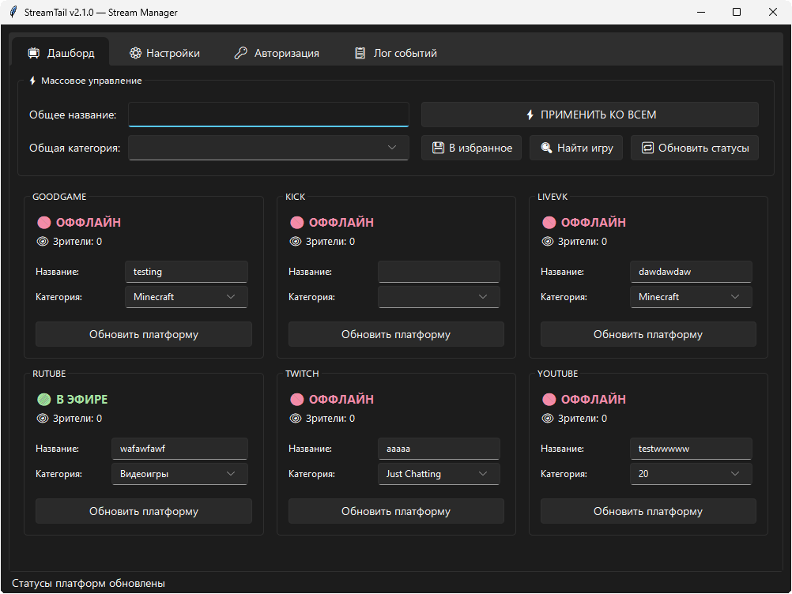
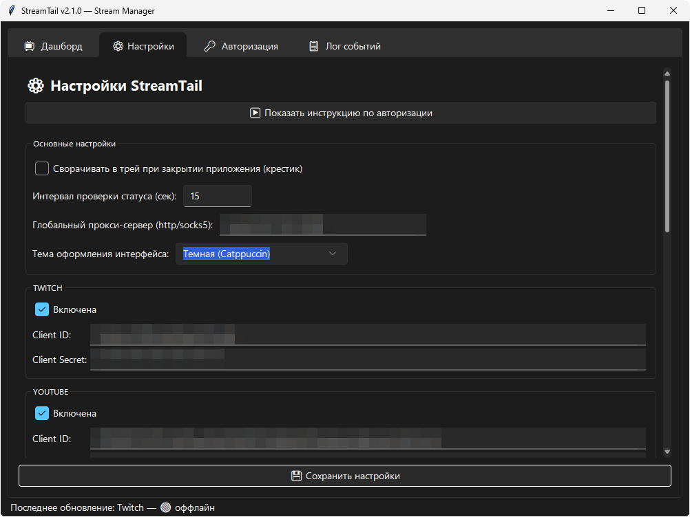
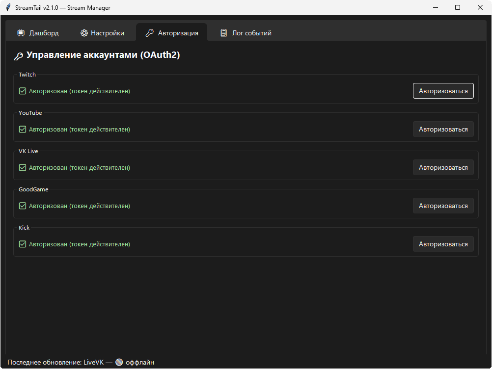

# StreamTail 🚀


**StreamTail** — современный, асинхронный и высокопроизводительный менеджер трансляций для стримеров. Управляйте статусом, названием и категорией трансляции одновременно на всех популярных платформах в один клик.

## Скриншоты



<details>
<summary>Дополнительные скриншоты</summary>

---

>
> ### Настройки
> 
> 
> ### Авторизация
> 
> 
</details>

## ✨ Ключевые особенности

*   **Мультиплатформенность:** Полноценная интеграция с **Twitch, YouTube, VK Видео Live, Kick, GoodGame и RUTUBE**.
*   **Глубокая асинхронность:** Параллельный опрос статуса всех платформ через `asyncio.gather` — никаких зависаний и очередей.
*   **Умный парсинг кук (Smart Cookie Parser):** Принимает куки в любом формате (JSON-массив, Netscape/текстовый файл) и автоматически преобразует их в чистые HTTP-заголовки.
*   **Аппаратная безопасность:** Защищенная SQLite база данных `streamtail.db` шифрует все ваши токены и API-ключи по уникальному аппаратному хэшу материнской платы (Hardware ID).
*   **Проксирование:** Глобальная поддержка HTTP/SOCKS5 прокси-серверов для стабильной работы с YouTube и Twitch без таймаутов.
*   **Дизайн и UX:** Современная темная тема (sv-ttk), сворачивание в системный трей, всплывающие уведомления (Plyer) и адаптивная сетка дашборда.

## 📦 Установка

1. Склонируйте репозиторий:
   ```bash
   git clone <repository_url>
   cd streamtail
   ```

2. Установите зависимости:
   ```bash
   pip install -r requirements.txt
   ```

3. Запустите приложение:
   ```bash
   python main.py
   ```

## ⚙️ Быстрый старт

1.  Запустите программу. Перейдите во вкладку **Настройки**.
2.  Разверните блок **Инструкция по авторизации** в самом верху.
3.  Настройте платформы:
    *   **Kick:** Введите имя канала и скопируйте куки из браузера.
    *   **RUTUBE:** Введите ID канала и куки в любом формате.
    *   **VK Live:** Скопируйте JSON-строку `auth` из LocalStorage сайта.
    *   **Twitch / YouTube / GoodGame:** Пройдите авторизацию в 1 клик через вкладку **Авторизация**.
4.  Нажмите **Сохранить настройки** и наслаждайтесь управлением!
